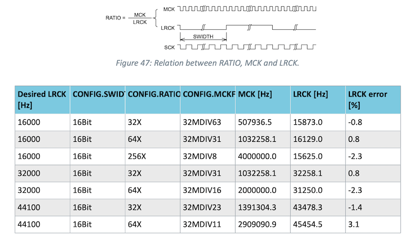

# JSN-SR04_Gen3_RK

Library for JSN-SR04 ultrasonic distance sensor for Particle Gen 3 devices


## Level shifter required!


## Calculations

The TRIG pin is normally low, you pulse it high for 10 µS to begin measurement.

The ECHO pin is normally low, it will go high during the measurement, and the length of the high pulse determines the distance:

Distance = (T × C) / 2

where:

- T is the time of the pulse in seconds  
- C is the speed of sound (340 meters/sec)

The detection range of the sensor I got is 2 cm (0.02 m) to 500 cm (5 m). This means the time of the pulse ranges from:

- Min: 0.02 m = 0.00011765 sec = 0.1176 ms = 117 µs
- Max: 5 m = 0.0294 sec = 29 ms


The accuracy of the sensor I got is claimed to be 0.3 cm, or 0.0003 meters. 

- 0.0003 meters = 0.00000186 sec = 0.00176 milliseconds = 1.76 microseconds
- 568,181 Hz

We really want to sample at roughly twice that frequency, if possible, or even higher.

The I2S peripheral has many possible configurations:



Note that the sample rate (LRCK), is the number of 16-bit stereo samples. Each bit of our input is one of those bits, so a sample rate of 32000 Hz is actually samples at 1,024,000 Hz, which is close to our target. Perfect!

In other words, with a 1 MHz sample rate, we can measure the width of a pulse with a resolution if 1 µs (1 microsecond), without touching interrupts and with no interrupt latency, because the I2S peripheral does not require bit-level interrupts. 

The total buffer length is the length of the TRIG pulse (10 µS) + setup time + maximum detection pulse (29 ms). 

The TRIG pulse output should be 10 µs. This is a minimum of 10 bits of output 1. We use 16 bits because it's really convenient with 16-bit samples.

The setup time is not in the datasheet, but dumping the ECHO pin output from the sensor looks like this:

```
0000005026 [app] INFO: 0090: 0000 0000 0000 0000
0000005026 [app] INFO: 0094: 03ff ffff ffff ffff
0000005027 [app] INFO: 0098: ffff ffff ffff ffff
0000005027 [app] INFO: 009c: ffff ffff ffff ffff
0000005028 [app] INFO: 00a0: ffff ffff ffff ffff
0000005028 [app] INFO: 00a4: ffff ffff ffff ffff
0000005029 [app] INFO: 00a8: ffff ffff ffff ffff
0000005029 [app] INFO: 00ac: ffff ffff ffff ffff
0000005030 [app] INFO: 00b0: ffff ffff ffff ffff
0000005030 [app] INFO: 00b4: ffff ffff ffff ffff
0000005031 [app] INFO: 00b8: ffff ffff fffe 0000
0000005031 [app] INFO: 00bc: 0000 0000 0000 0000
0000005032 [app] INFO: 00c0: 0000 0000 0000 0000
```

- The time from the falling TRIG pulse to ECHO going high is 0x93 samples (147), or 147 µs. 

- In other words, the leading overhead should be assumed to be around 150 samples.

- When the signal goes high the sample has a value of 0x03ff. The leftmost (MSB) is the first, chronologically.

- When the signal goes low the sample has a value of 0xfff3. The rightmost (LSB) is the last, chronologically.

I set the leadingOverhead to 152 samples.

The ECHO sampling is 960 samples at 32 kHz, but each sample is 16 bits x 2, so this is 3,840 bytes. However, we need both transmit and receive buffers, so 7,680 bytes. Plus the 608 bytes of leading overhead, so 8,288 bytes.

However, in practice these sensors are pretty unreliable at long distances. You can configure the library for the full distance, but I arbitrarily set the default maximum length to 2 meters, which reduces the memory requirements to 384 TRIG samples + 152 samples of overhead = 536 samples, or 2,144 bytes. This seems reasonable to me.

